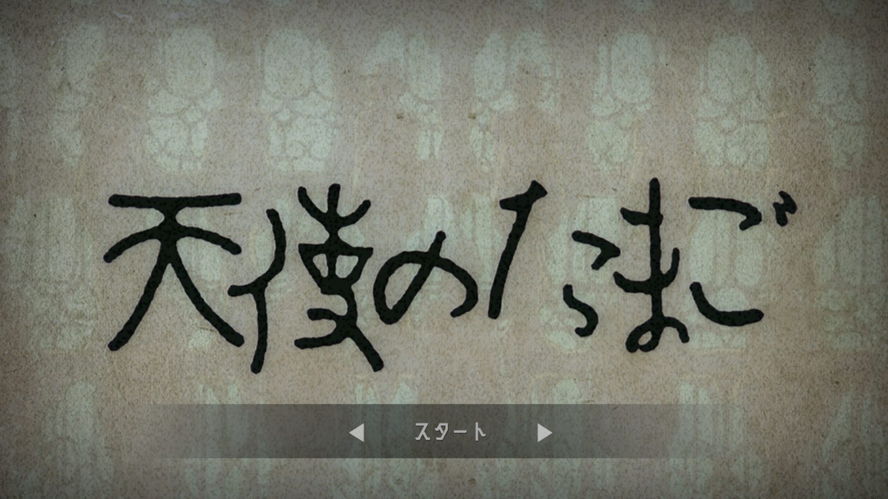
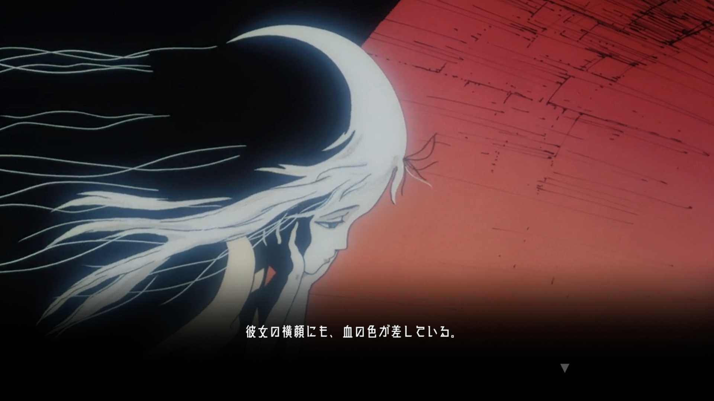
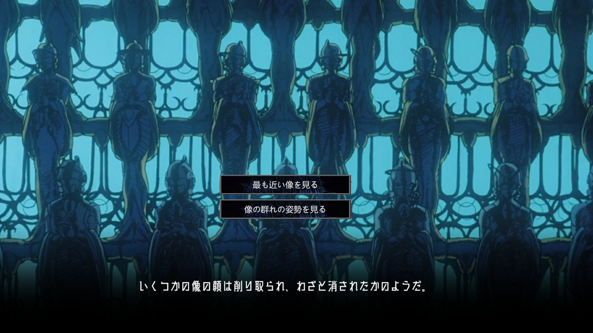
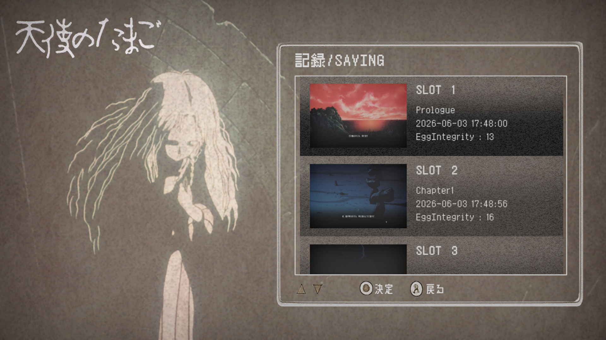

# 天使の卵 - TenshiNoTamago

- 基于日本1985年押井守电影《天使の卵》改编的文字游戏。
- 使用 Unity 2020.3 开发，数据驱动（JSON）。

## 故事

废墟。红天。一个背着十字武器的男人，一个抱着蛋的女孩。
他们在这片被审判过的土地上行走，对话，沉默。
卵里面是什么？没有人知道。

## 功能

- 章节式叙事（序章 + 三章）
- 注视点选项系统（影响卵完整度）
- 结局分支（根据卵完整度变化）
- 日文 / 中文 切换
- 存档 / 读档（5个槽位，带缩略图）
- 自动播放模式
- 文字速度调节
- 背景异步加载 + 缓存

## 操作

| 操作 | 方式 |
|------|------|
| 文字加速 | 点击屏幕 |
| 选择选项 | 点击按钮 |
| 主菜单切换 | 左右箭头 / 键盘左右键 |
| 读档切换 | 点击 / 键盘上下键 |
| 确认 | 点击按钮 / 回车键 |
| 返回 | 点击按钮 / ESC 键 |

## 开发环境

- Unity 2020.3.48f1c1
- C# + JSON

## 美术-音乐素材

插图/立绘：《天使の卵》（押井守）
字体：廻想体 / Noto Sans JP
音效：电影截取

## 截图

| 主菜单（日文） | 游戏内（氛围） |
|----------------|----------------|
|  |  |

|    选项界面    | 存档界面（读档） |
|----------------|------------------|
|  |  |
